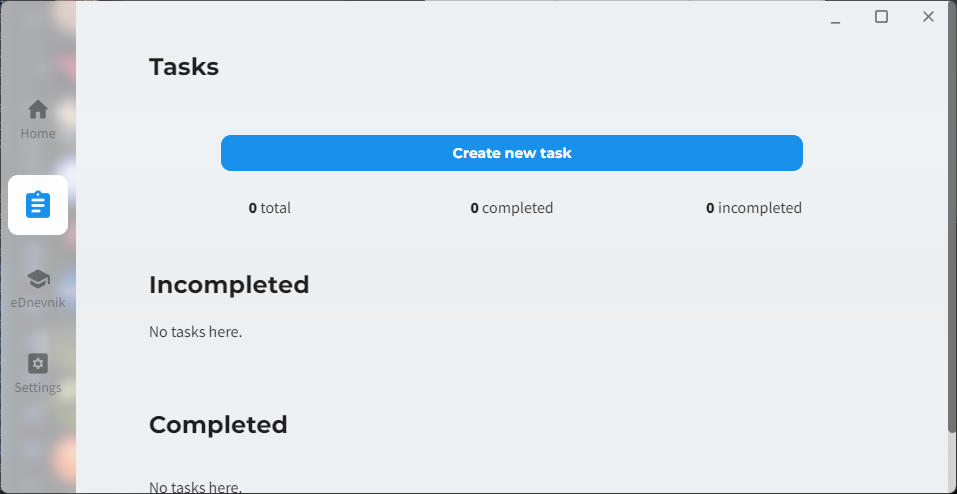
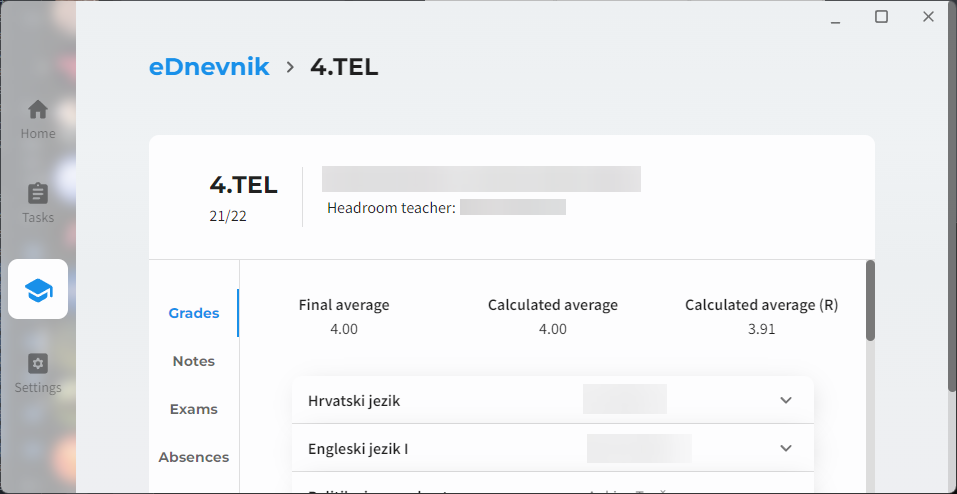
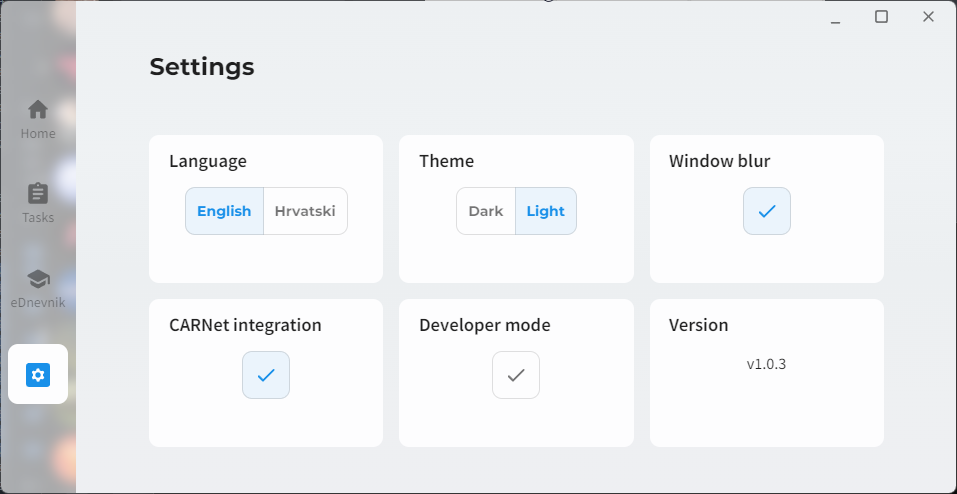
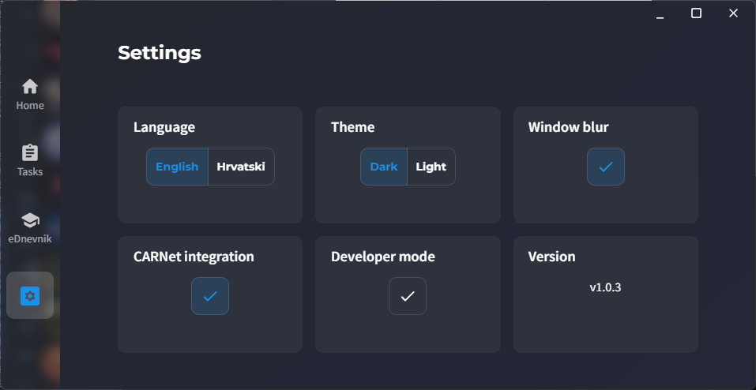

    
    <h1>
        piksel
    </h1>
    <b>EN</b> | <a href="./README_HR.md">HR</a>
    

        A daily-driver app for students.
    

## About
Piksel is an application made in [Electron](https://github.com/electron/electron) in order to help students with their hectic life and schedule.

Piksel provides features like [eDnevnik](https://ocjene.skole.hr/) integration and tracking your tasks for the day.

## Screenshots

List of screenshots

## Building
Download the source code and `cd` into the `/src` folder. Run `npm install` to install all dependencies. Then, run `npm run rebuild` to rebuild native modules.

Run `npm run dev` or `npm run prod` depending on which environment you want the build the app for. You can build specific parts of the app as well (look into `package.json` for more information).

Running `npm start` will tell electron to start the app.

Packaging the app is done through [Electron Builder](https://www.electron.build/). For more information on how the packaging works, check out the [GitHub workflow](https://github.com/cryy/piksel/blob/main/.github/workflows/node.js.yml).

