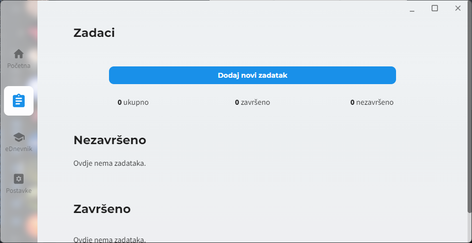

    
    <h1>
        piksel
    </h1>
    <a href="https://github.com/cryy/piksel">EN</a> | <b>HR</b>
    

         Aplikacija za dnevno korištenje namijenjena učenicima i studentima. 
    

## O projektu
Piksel je aplikacija napravljena pomoću [Electrona](https://github.com/electron/electron) kako bi se pomoglo učenicima i studentima s njihovim životom i rasporedom.

Piksel nudi značajke poput [eDnevnik](https://ocjene.skole.hr/) integracije i praćenje vaših zadataka za određeni dan. Također možete prilagoditi aplikaciju vašem ukusu.

## Snimke zaslona programa

Lista snimka

## Kompajliranje koda
Preuzmite izvorni kod i koristite `cd` naredbu kako bi došli u `/src` mapu. Pokrenite naredbu `npm install` kako bi instalirali sve biblioteke. Zatim, pokrenite naredbu `npm run rebuild` kako bi kompajlirali sve "native" biblioteke.

Pokrenite naredbu `npm run dev` ili `npm run prod` ovisno o željenom okruženju aplikacije. Također možete kompajlirati specifične djelove aplikacije (pogledajte `package.json` za više informacija).

Pokretanjem naredbe `npm run start` pokrećete aplikaciju pomoću Electron biblioteke.

Pakiranje aplikacije upotrebljava [Electron Builder](https://www.electron.build/). Za više informacija o tome kako pakiranje radi, pogledajte [GitHub workflow](https://github.com/cryy/piksel/blob/main/.github/workflows/node.js.yml).

